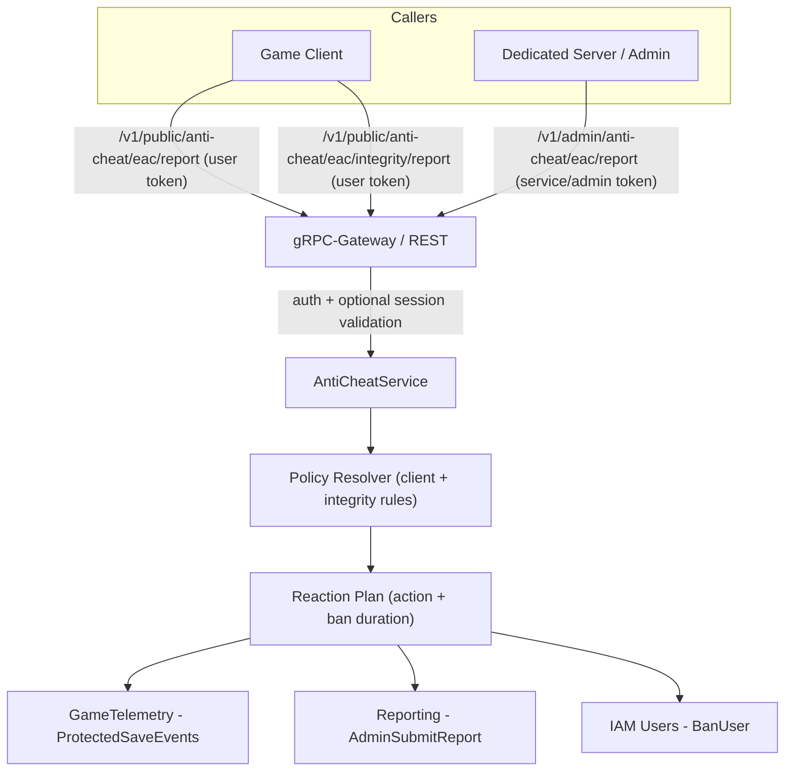

# Anti-Cheat Reporting Extend App



This Extend app turns Easy Anti-Cheat (EAC) signals into AccelByte telemetry, moderation reports, and bans. Every request is authenticated by the gRPC interceptors, optionally session-validated, mapped to a policy-driven reaction, then executed via AccelByte services.

## Endpoints
- `POST /v1/public/anti-cheat/eac/report` — user token; requires `sessionId` unless session validation is disabled. Verifies the caller is the session leader and that `userId` belongs to the session.
- `POST /v1/admin/anti-cheat/eac/report` — service/admin token; requires `sessionId` unless session validation is disabled. Verifies `userId` is in the session (no leader requirement).
- `POST /v1/public/anti-cheat/eac/integrity/report` — user token; no session check. Maps integrity violations to client policy actions before executing telemetry/report/ban.

Violation body (public/admin):
```json
{
  "userId": "uuid-string",
  "clientActionReason": "ACTION_CLIENT_VIOLATION",
  "clientActionDetailsReasonString": "optional details",
  "sessionId": "game-session-id"
}
```

Integrity body:
```json
{
  "userId": "uuid-string",
  "violationType": "INTEGRITY_GAME_FILE_MISMATCH",
  "violationMessage": "optional details"
}
```

Response (all endpoints):
```json
{
  "appliedAction": "TEMP_BANNED|PERM_BANNED|LOGGED|REPORTED",
  "telemetryRecorded": true,
  "moderationReported": false,
  "banDurationSeconds": 0
}
```

## How it works
- **Auth & gateway**: `main.go` wires gRPC interceptors (permission checks when `PLUGIN_GRPC_SERVER_AUTH_ENABLED=true`), the HTTP gateway, tracing, and Prometheus metrics.
- **Session validation**: `GameSessionValidator.ValidateSession` checks session membership (and leader status for the public route) unless `DISABLE_SESSION_VALIDATION=true`.
- **Policy resolution**: `PolicyResolver` in `pkg/service/eac_policy_service.go` maps `ClientActionReason` and `IntegrityViolationType` to a `PolicyRule` (action, telemetry flag, optional ban duration).
- **Reaction execution**: `applyPlan` triggers `SendTelemetry`, `SubmitReport`, and `ApplyBan` from `pkg/service/actions.go`. Ban actions skip moderation reporting; telemetry is optional per policy.
- **Metrics**: `Metrics.requests` is labeled by source/reason/action/status for Prometheus scraping.

### Policy sets to adjust
- Default client rules live in `buildDefaultPolicies()`; integrity rules in `buildDefaultIntegrityPolicies()` (`pkg/service/eac_policy_service.go`). Update these maps to change the enforcement matrix (e.g., swap an action, tweak ban durations).
- `ResolveClientAction` and `ResolveIntegrity` fall back to `LOGGED + telemetry` when a reason is missing—add explicit entries for new reasons to avoid silent defaults.

### Hooks commonly customized
- `ActionClients.SendTelemetry` — adjust payload/namespace for telemetry events.
- `ActionClients.SubmitReport` — change category/comment/extra metadata sent to Reporting.
- `ActionClients.ApplyBan` — modify ban type, comment, or end-date calculation.
- `GameSessionValidator.ValidateSession` — plug in alternative session/party membership rules if your topology differs.

## Environment
- `AB_BASE_URL` — AGS base URL.
- `AB_CLIENT_ID` / `AB_CLIENT_SECRET` — IAM client for service calls.
- `AB_NAMESPACE` — namespace used for telemetry/reporting/bans and session lookup.
- `BASE_PATH` — base path for gateway/UI (e.g., `/anti-cheat`).
- `PLUGIN_GRPC_SERVER_AUTH_ENABLED` — `true` to enforce auth interceptors (default).
- `DISABLE_SESSION_VALIDATION` — set to `true` to bypass session membership checks (default `false`).
- Optional: `LOG_LEVEL`, `OTEL_SERVICE_NAME`, `ENABLE_PPROF`.

### Session validation
- Public and admin violation requests require `sessionId` unless `DISABLE_SESSION_VALIDATION=true`.
- Session lookup calls `Session GetGameSession`; missing sessions or non-membership return errors.
- Public route requires caller to be the session leader; admin route only checks membership.
- IAM permission needed: `NAMESPACE:{namespace}:session:game [read]`.

## Build & Run
- Regenerate protos/openapi: `make build` (dockerized) or `./proto.sh`.
- Run locally (envs set): `go run ./...`
- Run in containers: `docker compose up --build`

## Structure
- `main.go` — wiring (auth interceptors, metrics, gateway, action clients).
- `pkg/proto/service.proto` — API surface; stubs in `pkg/pb`.
- `pkg/service/eac_policy_service.go` — handlers, policy resolution, session validation, metrics.
- `pkg/service/actions.go` — integrations (GameTelemetry, Reporting, IAM bans).

## Testing
- Set `BASE_PATH` and module cache envs if sandboxed, then `go test ./...` (needs network to download modules).
